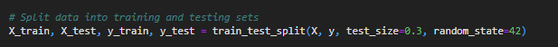

# Multi-Classification-Prediction-UFO-Shape-Classifier-

### Problem Statement

The goal of this project is to classify UFO sightings based on their shapes and identify potential trends or patterns using machine learning.

### Data Source and Background

The dataset for this project is sourced from Kaggle and contains over 80,000 reports of UFO sightings over the last century. The dataset includes city, state, time, description, and duration of each sighting, with two versions available: scrubbed and complete. The complete data includes entries with missing or erroneous information.

**Data Source**: https://www.kaggle.com/datasets/NUFORC/ufo-sightings?resource=download

**Content**

There are two versions of this dataset: scrubbed and complete. The complete data includes entries where the location of the sighting was not found or blank (0.8146%) or have an erroneous or blank time (8.0237%). Since the reports date back to the 20th century, some older data might be obscured. Data contains city, state, time, description, and duration of each sighting.

### Importance of the Question:

**Inspiration**

1. What areas of the country are most likely to have UFO sightings?
2. Are there any trends in UFO sightings over time? Do they tend to be clustered or seasonal?
3. Do clusters of UFO sightings correlate with landmarks, such as airports or government research centers?
4. What are the most common UFO descriptions?

**Importance**

    - Understanding the patterns and classifications of UFO sightings has several important implications:

    - Public Interest and Safety: By identifying patterns in UFO sightings, we can address public curiosity and concerns. If certain shapes or trends correlate with specific times or locations, authorities can better manage public safety and information dissemination.

    - Scientific Inquiry: This research can contribute to the broader scientific community's understanding of unexplained aerial phenomena. By providing a systematic analysis of UFO sightings, we add to the body of knowledge that may inspire further research and technological advancements.

    - Policy Making: Insights from this analysis can aid governmental and defense agencies in resource allocation and preparedness. Recognizing patterns in sightings might help in developing protocols for investigation and response.

    - Cultural Impact: UFO sightings are a part of modern folklore and cultural identity. This project can provide a data-driven narrative that complements anecdotal evidence, enriching cultural and historical contexts.

### Tools Requirements and Techniques Used

1. Tools requirements:
    - CPU, general-purpose processors, Recommend Intel core i7/i9 or better. 
    - Python programming language 
    - Jupyter Notebook  or Jupyter Lab for interactive data analysis and visulization (Google Colab can also work)
    - Integrated Development Environments (IDEs): Such as PyCharm or VSCode for code development and debugging.
    - Install all neccessary python packages (Pandas, scikit-learn, seaborn, numpy, etc...) for analytics and suupervised and unsupervised learning models. 

2. Data Preprocessing:
    - Cleaning and preparing the data.
    - Handling missing values and standardizing formats.

3. Exploratory Data Analysis (EDA):
    - Initial examination to uncover basic patterns, anomalies, and insights.

4. Feature Engineering:
    - Creating relevant features to improve model performance.

5. Machine Learning Models:
    - Multi-Class Classification: Using algorithms like Decision Trees, Random Forest, and Support Vector Machines (SVM).
    - Clustering: Using methods like K-Means and DBSCAN to identify patterns and trends.

### Expected Results

1. Classification Model:
    - Develop a robust classification model to predict UFO shapes based on sighting reports.

2. Trend Analysis:
    - Identify temporal and geographical trends in UFO sightings, such as seasonal patterns and regional hotspots.

3. Correlation Insights:
    - Analyze correlations between UFO sightings and various landmarks or significant locations.

## Data Exploration

Firstly, import all neccessary resources and tools, primarly python packages to preform data transformation and analysis. 

**General Info** 

**Target feature distribution (UFO shape)**

.png)

The chart graphically represents the distribution of various UFO shapes reported in the dataset. The bar chart, displaying the count of sightings for each shape, reveals that the most frequently reported shape is "light," with 16,565 sightings, followed by "triangle" with 7,865 sightings and "circle" with 7,608 sightings. Other commonly reported shapes include "fireball" (6,208 sightings), "other" (5,649 sightings), and "unknown" (5,584 sightings). 

Shapes such as "sphere," "disk," and "oval" also have significant counts, ranging from approximately 3,700 to 5,400 sightings. Less frequently reported shapes, such as "rectangle," "cylinder," and "diamond," have counts between 1,000 and 1,300. Rarely reported shapes, such as "teardrop," "cone," and "cross," have fewer than 800 sightings each. Interestingly, there are several shapes with extremely low counts, including "delta," "round," "crescent," "pyramid," "flare," "hexagon," "dome," and "changed," each having between 1 and 7 sightings.

The accompanying red line plot shows the cumulative number of sightings, which provides a visual indication of how the total number of sightings accumulates as different shapes are added. This combination of bar chart and line plot offers a comprehensive view of both the individual distribution and cumulative effect of UFO shape sightings in the dataset.

## Initial Data Cleaning and Imputation

To ensure the integrity of the original dataset, a new dataset was created specifically for the cleaning process. The "duration (hours/min)" column was removed due to redundancy, as the duration in seconds was already present. Features were transformed to their respective datatypes, such as converting numeric features to integers or floats and datetime features to datetime objects. The state and country features were analyzed and imputed to address missing values. Leading and trailing spaces were stripped from the data to ensure standardization and consistency. Extreme outliers, particularly in the target variable, were removed. Imputation was performed to address redundant definitions across multiple classes within the target variable. Finally, after these cleaning steps, any remaining rows with NA values were dropped to produce a clean and consistent dataset for further analysis.

To begin the data cleaning process, a new dataset, ufo_clean, was created by copying the original dataset. The redundant "duration (hours/min)" column was dropped. Dates were transformed to the datetime format for the "datetime" and "date posted" columns, ensuring consistency in date handling. The "duration (seconds)" column was converted to a numeric datatype to facilitate analysis, and the "latitude" column was also transformed to a numeric format. These steps ensured that the data types were appropriate for further analysis and cleaned of any inconsistencies. Below illustration decribes the new dataset with the changes.

**Remove outliers Imputing target feature Shape**

It is clear from the above information, that there are about 8 shapes that have extremly minimal data points. Due to lack of observations on these shapes, they may be removed from the dataset.This data is not useful for predictive classification. Now we will have removed 8 shapes from the data, and are left with 21 shapes for multi-class classification.

Looking at the left over shapes, we can observe somethign really important. Some shapes have synonymous definitions. It is reasonable to define the shape of an egg as an oval. Yet, in the shape classes, there is a class that represents oval 'shaped' observation and another class is represented as an egg shaped observation. The same goes for circle and disk, cylinder and cigar. 

When it comes to 'unknown' or 'other', based on the comments provided, the shape of the sighting may not have been recorded or was concluded not definitive. There are instances of similar or arbitray obervations. This means, unknown and other can be used interchangeably.

The obervations for changing and formation are also similar when viewing comments on these classes. Both formation and changing shape values describe some sort of inconsistency in the subject of the observation. Both decribes a metamorphose property pertaining to the subject of the observation.

From these observation, let us impute some of the classes and combine with their counterpart. We will selected one class and name and map to the other while maintain all other attributes integrity. Combining synonymous classes in your dataset based on observed similarities is a reasonable idea, particularly when dealing with categorical data where overlapping or synonymous categories can add noise and reduce the clarity of analysis. Below is the reduced and imputed ufo shape feature details.

shape_mapping = {
    'circle': 'disk',
    'egg': 'oval',
    'cylinder': 'cigar',
    'unknown': 'other',
    'formation': 'changing'
}

##### Benefits

  - Data Simplification: Reducing the number of classes makes the dataset simpler and more manageable, which can improve the performance of your clustering algorithms and make the results easier to interpret.
  - Increased Sample Size: By merging similar categories, you increase the sample size of the combined class, which can lead to more robust statistical analyses.
  - Reduced Redundancy: Eliminating synonymous categories helps in reducing redundancy in the dataset, which can improve the overall quality of the data.

##### Considerations

  - Loss of Specificity: While combining classes can simplify the data, it might also lead to a loss of specific information that could be valuable. For instance, the distinction between 'disk' and 'circle' might carry some nuances that are lost when combined.
  - Validation: Ensure that the mappings are validated by domain experts if possible. What might seem synonymous to a layperson could have subtle differences in a specialized field like UFO sightings.
  - Consistency: Make sure the mappings are applied consistently across the dataset to avoid introducing new inconsistencies.

**Impute state and county features**

1. To address inconsistencies and missing values in the state and country features of the UFO sightings dataset, several steps were taken. Initially, country codes were mapped to their respective full names (e.g., 'us' to 'United States') to prevent ambiguity with state abbreviations. This mapping ensured clarity in distinguishing between country and state values.

country_mapping = {
    'us': 'United States',
    'ca': 'Canada',
    'gb': 'United Kingdom',
    'de': 'Germany',
    'au': 'Australia'
}

2. Upon examining instances where the country was null but the state was populated, it was observed that certain states like 'tx' (Texas) were mistakenly treated as countries. Logical imputation was applied, where if a state belonged to the US or Canada based on predefined lists of state abbreviations and Canadian provinces, it was assigned the corresponding country name.

  - Below is country and state feature where country is NA

3. Further investigation revealed inconsistencies in non-US and non-Canada countries where state values were either missing or incorrectly mapped (e.g., 'nc' mapped to 'gb' for United Kingdom). To rectify this, a custom function was developed to correctly map state values to their respective countries. States within these countries were standardized to avoid misinterpretation of the data.

  - Understanding states within non US or Canada countries

4. After applying these transformations and imputations, remaining rows with null values were dropped to ensure dataset completeness and integrity. The resulting ufo_clean dataset now contains standardized state and country information suitable for further analysis and modeling, reducing ambiguity and ensuring accurate representation of geographical attributes in UFO sighting reports.

**Duration (seconds) - removing outliers**

The max duration of a sighting is 97836000.0 seconds, the minimum duration is 0.001 seconds and the average duration is 7877.286460723777 seconds. we can see that there are some values for duration that are extreme values which can impact the models and training. We can preform IQR method to rid outliers but the extreme outliers can also impact lower bound and upper bound when calculating 25% and 75% quantiles. Lets rid of extreme outliers using percentile method. Below is the distribution after removing extreme outliers. After removing outliers max duration of a sighting is 7200.0 seconds, the minimum duration is 1.5 seconds and the average duration is 611.0101017590368 seconds. 

**Dataset after initial cleaning and removing remaining null values**

- cleaned dataset statistical summary for numerical data

## Feature Analysis

After cleaning the UFO sightings dataset and ensuring the integrity of its features, the next step involves exploring potential relationships and trends among these features.

**UFO sightings change over time**

The plot illustrates the temporal trends in UFO sightings across different countries, focusing on the United States compared to other countries where sightings are relatively consistent over time. The trend shows a notable increase in UFO sightings over time in the United States. This could indicate either a genuine increase in sightings or potentially more comprehensive reporting and data collection methods over the years. In contrast, sightings in other countries appear relatively consistent across the years. This observation may stem from several factors, including varying levels of public interest, reporting protocols, or cultural differences in UFO reporting and interpretation. The consistency observed in other countries could also be influenced by the availability of data. If data collection methods or reporting standards differ significantly between countries, it could lead to disparities in the number of recorded sightings.

**Exploring UFO obervations by Cities**

1. Unique Cities: There are 16,833 unique cities recorded in the dataset.

2. Observation Counts:
  - Less than 10 Observations: 15,347 cities fall into this category, indicating a majority of cities have relatively few recorded UFO sightings.
  - More than 100 Observations: Only 56 cities have 100 or more recorded UFO sightings, representing a smaller subset of cities with more frequent sightings.

3. Summary Table: The table summarizes the distribution of cities based on the number of UFO observations:

The pie chart visually represents these categories, illustrating the proportion of cities in each observation range. It shows that the vast majority of cities (over 60%) have only 1 recorded UFO observation, highlighting the variability and sparse nature of UFO sighting reports across different cities.

This analysis provides insights into the distribution of UFO sightings across cities, emphasizing the prevalence of cities with few sightings and a smaller number of cities with more frequent UFO observations.

The cities below had the highest reported sightings in the entire dataset:

**Below Scatter plots shows the data distribution with respect to relationships between different features**

1. Duration of sightings of different UFO shapes by country

2. latitude and longitude of sightings of different UFO shapes by country

3. Sightings distribution by country

- Due to a high skewed distribution of country datapoints, it will be excluded from modeling.

## Modeling

Before we construct any classification models let us preprocess our data. Preprocessing the UFO dataset is essential to ensure that our data is in a suitable format for machine learning models. Initially, we extracted additional features from the datetime column, specifically the year and month, which can provide valuable temporal insights. The target variable, 'shape', was encoded using LabelEncoder to transform categorical shape labels into numerical values required for model training. For the features used in modeling, we selected 'state' and 'duration (seconds)', ensuring to standardize the numeric feature 'duration (seconds)' using StandardScaler to scale data for consistent model performance. Categorical feature 'state' was encoded using OneHotEncoder to convert state names into binary vectors, preserving categorical information without imposing numerical order.

Splitting the preprocessed data into training and testing sets is crucial to evaluate model performance on unseen data accurately. By dividing the dataset into 70% training and 30% testing subsets, we ensure that our models can learn patterns from the training data while being evaluated on independent test data to assess generalization. Preprocessing facilitates data standardization and transformation, ensuring that models can effectively interpret and learn from the data without biases from differing scales or formats. Ultimately, preprocessing prepares our UFO dataset for robust machine learning model construction and evaluation, enabling us to make accurate predictions about UFO shapes based on geographical and temporal characteristics.

### RandomForest Classifier

Random Forests stand out as a robust choice for multi-class classification tasks due to their versatile capabilities. They excel in handling complex data structures and managing overfitting through ensemble learning, where multiple decision trees collectively contribute to robust predictions. This approach not only enhances generalization but also provides valuable insights into feature importance, crucial for understanding the driving factors behind each class prediction. Moreover, Random Forests are known for their reliability in diverse datasets, making them a powerful tool for accurate and scalable multi-class classification tasks.

The provided pipeline encapsulates a streamlined approach to machine learning model building in Python, particularly in a Jupyter notebook environment. It integrates both preprocessing and modeling steps into a single coherent workflow. The ColumnTransformer within the preprocessing step allows for simultaneous handling of numerical (StandardScaler) and categorical (OneHotEncoder) features. This ensures that all necessary transformations are applied consistently across different types of data before feeding them into the classifier.

**Randomforest model classification report**

- Training data accuracy 

  - Precision: The precision measures how many of the predicted instances for each class are actually correct. Here, precision scores are generally low across most classes, indicating a high rate of false positives. For instance, classes like 0, 1, 2, 3, etc., have precision values ranging from 0.07 to 0.67. This suggests that the model's predictions for these classes have a high chance of being incorrect.
  - Recall: Recall measures how well the model captures instances of each class. It is also generally low, with values ranging from 0.01 to 0.71. This indicates that the model misses a significant number of instances of each class.
  - F1-score: The F1-score is the harmonic mean of precision and recall, providing a balanced measure between them. The F1-scores are generally low across classes, ranging from 0.00 to 0.38.
  - Support: Indicates the number of instances of each class in the training set.

- Test data accuracy 

  - The pattern in the test set classification report is similar to the training set.
  - Precision, Recall, and F1-score: The metrics show similarly low values across most classes, indicating that the model's performance did not improve significantly when applied to unseen data. Precision values range from 0.00 to 0.22, recall from 0.00 to 0.61, and F1-score from 0.00 to 0.32.
  - Support: Indicates the number of instances of each class in the test set.

Precision is crucial because it tells us how reliable the positive predictions are for each class. In a multi-class classification problem like this, low precision scores indicate that when the model predicts a particular shape, it is often incorrect. This can lead to misclassification and unreliable predictions in real-world applications. Low precision can be problematic, especially if the consequences of misclassification are significant (e.g., in medical diagnoses or financial predictions). Improving precision involves reducing false positives, which often requires refining the model's decision boundaries or addressing class imbalance issues in the dataset.

while the Random Forest model shows some ability to predict classes, the low precision scores indicate a need for further model refinement or consideration of different algorithms or data preprocessing techniques to improve accuracy and reliability. Using GridSearch to explore other alorithms to train our data can help identify the best configuration that can handle this multi-class classification problem. 

## Exploring other algorithms with GridSearch 

The GridSearch process explored six different classification models. 

1. Logistic Regression, KNN, and Decision Tree:

  - These initial algorithms were chosen for their versatility and interpretability. They were run with varying hyperparameters to identify the best configuration that could handle the multi-class classification problem posed by UFO shapes.

2. Random Forest Classifier, XGBoost, and SVC (Support Vector Classifier):

  - These algorithms were selected based on their ability to handle complex data interactions, non-linear relationships, and high-dimensional data. Each algorithm was tuned using GridSearch to optimize its performance.

**Importance of Trying Different Algorithms**

  - Diverse Capabilities: Each algorithm has unique strengths. For instance, Random Forests are robust against overfitting and handle categorical features well. XGBoost excels in boosting weak learners and can capture complex interactions. SVMs are effective in high-dimensional spaces with complex decision boundaries.

  - Performance Variability: The goal was to test if more complex algorithms could better capture the underlying patterns in the UFO dataset that simpler models might miss. By comparing results across different algorithms, we gain insights into which approach might be most effective for this specific classification task.

**Are They Good for Multi-Class Modeling?**

  - Yes, but with nuances: All selected algorithms (Logistic Regression, KNN, Decision Tree, Random Forest, XGBoost, SVC) are capable of handling multi-class classification tasks. They differ in their approach to handling class imbalances, non-linear relationships, and feature interactions.

  - Algorithm Suitability: The suitability depends on factors such as dataset size, feature complexity, and computational resources. For instance, SVMs are memory-intensive but effective in high-dimensional data, while Decision Trees are less computationally intensive but can overfit without proper pruning.

### Model preformance results

### Analysis of Model Performance

- RandomForestClassifier:
  - The RandomForestClassifier exhibited moderate performance across various metrics. With parameters set to max_depth=10 and n_estimators=500, it achieved a recall of 0.212 and an accuracy of 0.210. The precision_weighted_score was 0.155, indicating a reasonable balance between capturing patterns in the data and avoiding overfitting. Training time was relatively long at 121.51 seconds, reflecting the ensemble nature of Random Forests and the number of trees involved. This model likely benefited from its ability to handle complex relationships and feature interactions inherent in the dataset, making it a robust choice for multi-class classification tasks where linear separability is limited.

- XGBClassifier:
  - The XGBClassifier, known for its gradient boosting approach, showed performance metrics similar to the RandomForestClassifier but with slightly lower precision. It was optimized with a learning rate of 0.1 and 10 estimators. The model achieved a recall of 0.212 and an accuracy of 0.208, with a precision_weighted_score of 0.121. Training was quicker compared to RandomForestClassifier at 19.51 seconds, suggesting a trade-off between computational efficiency and model complexity. The choice of parameters might not have fully captured the intricate relationships within the data, potentially limiting its predictive power compared to other models.

- SVC (Support Vector Classifier):
  - The SVC struggled with the dataset's high dimensionality and class imbalance despite its capability to define hyperplanes for classification. With a regularization parameter C=0.1, it achieved a recall of 0.213 and an accuracy of 0.209. However, the precision_weighted_score was notably low at 0.067, indicating challenges in accurately predicting all classes. Training time was significantly longer at 614.84 seconds, highlighting the computational intensity of SVMs in high-dimensional spaces. The model's performance suggests limitations in effectively separating classes due to the complexity and distribution of feature data.

- Logistic Regression:
  - Logistic Regression, chosen for its simplicity and interpretability, showed consistent but relatively lower performance across all metrics. Regularized with C=0.01, it achieved a recall of 0.213 and an accuracy of 0.210. However, the precision_weighted_score was the lowest among all models at 0.044, indicating significant challenges in predicting class labels accurately. Training time was relatively short at 11.66 seconds, reflecting the model's computational efficiency but also its limitations in capturing complex non-linear relationships within the data.

- KNN (K-Nearest Neighbors):
  - KNN, a non-parametric method sensitive to local patterns, struggled with scalability and generalization in this dataset. Optimized with parameters leaf_size=10, n_neighbors=1000, and using distance-based weights, it achieved a recall of 0.188 and an accuracy of 0.191. The precision_weighted_score was 0.137, indicating moderate precision in classification. Training time was the longest among all models at 273.39 seconds, reflecting its computational demand in handling distance calculations across a large dataset. Despite its flexibility in capturing local patterns, KNN's performance suffered due to noise sensitivity and suboptimal parameter tuning.

- Decision Tree:
  - The Decision Tree model, characterized by its simplicity and interpretability, showed comparable performance to more complex models. With a shallow tree depth (max_depth=5) and using the Gini impurity criterion, it achieved a recall of 0.212 and an accuracy of 0.210. The precision_weighted_score was 0.173, indicating reasonable precision in classification tasks. Training time was exceptionally short at 1.20 seconds, making it the most computationally efficient model tested. The decision tree's performance suggests effective handling of basic relationships within the data but may have underfitted due to its limited depth, potentially missing more complex patterns.

**reasons for preformance**

The performance differences among these models stem from several factors:

- Data Imbalance: The dataset likely had imbalanced classes among UFO shapes, challenging models to accurately predict less frequent shapes.

- Feature Complexity: Features such as state, duration, and year may not have adequately captured the underlying patterns distinguishing UFO shapes, impacting model performance.

- Model Suitability: Each algorithm's effectiveness depends on its ability to handle feature interactions, non-linearities, and class imbalances. Some models may excel where others struggle due to inherent assumptions and parameter choices.

**Reasons for Low Scores**

- Data and Feature Considerations:
  1. Data Imbalance: The UFO dataset likely has imbalanced class distributions among UFO shapes. This imbalance can skew model training, leading to poor performance, especially on minority classes.

  2. Feature Relevance: The features used (e.g., state, duration, year) may not sufficiently capture the distinguishing characteristics of UFO shapes. If there are no strong correlations between these features and the target (UFO shapes), models struggle to generalize and predict accurately.

  3. Complex Relationships: UFO shape classification might inherently involve complex, non-linear relationships between features and shapes. Linear models like Logistic Regression may struggle to capture these complexities, while more advanced models like Random Forests and XGBoost can potentially learn these relationships better.

**Theoretical Insight**

- Modeling Challenges: UFO shape classification presents challenges typical of real-world classification problems: imbalanced data, complex relationships, and feature relevance. Addressing these challenges involves:

  1. Feature Engineering: Creating more relevant features that better differentiate UFO shapes could improve model performance.

  2. Algorithm Selection: Choosing algorithms that can handle non-linear relationships and class imbalances effectively.

  3. Model Evaluation: Precision, recall, and F1-score provide insights into model performance beyond simple accuracy, especially important when dealing with imbalanced classes.

Choosing the appropriate model involves understanding these nuances and optimizing parameters to achieve the best performance metrics. Further refinement in feature engineering, model tuning, and potentially exploring ensemble methods could enhance classification accuracy and precision for predicting UFO shapes effectively in real-world scenarios. Each model's strengths and weaknesses provide valuable insights into their applicability and performance in handling complex classification tasks. Additionally, exploring insights from the comment feature through NLP techniques could yield new features and improve the predictive capabilities of the model for UFO shapes. Integrating NLP to analyze comment text data opens avenues for deeper understanding and more nuanced classification strategies.