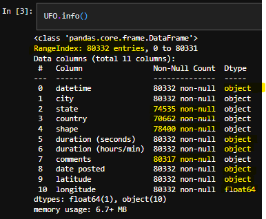
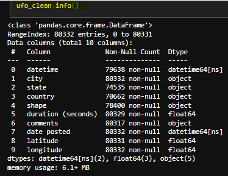

# Multi-Classification-Prediction-UFO-Shape-Classifier-

### Problem Statement

The goal of this project is to classify UFO sightings based on their shapes and identify potential trends or patterns using machine learning.

### Data Source and Background

The dataset for this project is sourced from Kaggle and contains over 80,000 reports of UFO sightings over the last century. The dataset includes city, state, time, description, and duration of each sighting, with two versions available: scrubbed and complete. The complete data includes entries with missing or erroneous information.

**Data Source**: https://www.kaggle.com/datasets/NUFORC/ufo-sightings?resource=download

**Content**

There are two versions of this dataset: scrubbed and complete. The complete data includes entries where the location of the sighting was not found or blank (0.8146%) or have an erroneous or blank time (8.0237%). Since the reports date back to the 20th century, some older data might be obscured. Data contains city, state, time, description, and duration of each sighting.

### Importance of the Question:

**Inspiration**

1. What areas of the country are most likely to have UFO sightings?
2. Are there any trends in UFO sightings over time? Do they tend to be clustered or seasonal?
3. Do clusters of UFO sightings correlate with landmarks, such as airports or government research centers?
4. What are the most common UFO descriptions?

**Importance**

    - Understanding the patterns and classifications of UFO sightings has several important implications:

    - Public Interest and Safety: By identifying patterns in UFO sightings, we can address public curiosity and concerns. If certain shapes or trends correlate with specific times or locations, authorities can better manage public safety and information dissemination.

    - Scientific Inquiry: This research can contribute to the broader scientific community's understanding of unexplained aerial phenomena. By providing a systematic analysis of UFO sightings, we add to the body of knowledge that may inspire further research and technological advancements.

    - Policy Making: Insights from this analysis can aid governmental and defense agencies in resource allocation and preparedness. Recognizing patterns in sightings might help in developing protocols for investigation and response.

    - Cultural Impact: UFO sightings are a part of modern folklore and cultural identity. This project can provide a data-driven narrative that complements anecdotal evidence, enriching cultural and historical contexts.

### Tools Requirements and Techniques Used

1. Tools requirements:
    - CPU, general-purpose processors, Recommend Intel core i7/i9 or better. 
    - Python programming language 
    - Jupyter Notebook  or Jupyter Lab for interactive data analysis and visulization (Google Colab can also work)
    - Integrated Development Environments (IDEs): Such as PyCharm or VSCode for code development and debugging.
    - Install all neccessary python packages (Pandas, scikit-learn, seaborn, numpy, etc...) for analytics and suupervised and unsupervised learning models. 

2. Data Preprocessing:
    - Cleaning and preparing the data.
    - Handling missing values and standardizing formats.

3. Exploratory Data Analysis (EDA):
    - Initial examination to uncover basic patterns, anomalies, and insights.

4. Feature Engineering:
    - Creating relevant features to improve model performance.

5. Machine Learning Models:
    - Multi-Class Classification: Using algorithms like Decision Trees, Random Forest, and Support Vector Machines (SVM).
    - Clustering: Using methods like K-Means and DBSCAN to identify patterns and trends.

### Expected Results

1. Classification Model:
    - Develop a robust classification model to predict UFO shapes based on sighting reports.

2. Trend Analysis:
    - Identify temporal and geographical trends in UFO sightings, such as seasonal patterns and regional hotspots.

3. Correlation Insights:
    - Analyze correlations between UFO sightings and various landmarks or significant locations.

## Data Exploration

Firstly, import all neccessary resources and tools, primarly python packages to preform data transformation and analysis. 

**General Info** 

**Target feature distribution (UFO shape)**

.png)

The chart graphically represents the distribution of various UFO shapes reported in the dataset. The bar chart, displaying the count of sightings for each shape, reveals that the most frequently reported shape is "light," with 16,565 sightings, followed by "triangle" with 7,865 sightings and "circle" with 7,608 sightings. Other commonly reported shapes include "fireball" (6,208 sightings), "other" (5,649 sightings), and "unknown" (5,584 sightings). 

Shapes such as "sphere," "disk," and "oval" also have significant counts, ranging from approximately 3,700 to 5,400 sightings. Less frequently reported shapes, such as "rectangle," "cylinder," and "diamond," have counts between 1,000 and 1,300. Rarely reported shapes, such as "teardrop," "cone," and "cross," have fewer than 800 sightings each. Interestingly, there are several shapes with extremely low counts, including "delta," "round," "crescent," "pyramid," "flare," "hexagon," "dome," and "changed," each having between 1 and 7 sightings.

The accompanying red line plot shows the cumulative number of sightings, which provides a visual indication of how the total number of sightings accumulates as different shapes are added. This combination of bar chart and line plot offers a comprehensive view of both the individual distribution and cumulative effect of UFO shape sightings in the dataset.

## Initial Data Cleaning and Imputation

To ensure the integrity of the original dataset, a new dataset was created specifically for the cleaning process. The "duration (hours/min)" column was removed due to redundancy, as the duration in seconds was already present. Features were transformed to their respective datatypes, such as converting numeric features to integers or floats and datetime features to datetime objects. The state and country features were analyzed and imputed to address missing values. Leading and trailing spaces were stripped from the data to ensure standardization and consistency. Extreme outliers, particularly in the target variable, were removed. Imputation was performed to address redundant definitions across multiple classes within the target variable. Finally, after these cleaning steps, any remaining rows with NA values were dropped to produce a clean and consistent dataset for further analysis.

To begin the data cleaning process, a new dataset, ufo_clean, was created by copying the original dataset. The redundant "duration (hours/min)" column was dropped. Dates were transformed to the datetime format for the "datetime" and "date posted" columns, ensuring consistency in date handling. The "duration (seconds)" column was converted to a numeric datatype to facilitate analysis, and the "latitude" column was also transformed to a numeric format. These steps ensured that the data types were appropriate for further analysis and cleaned of any inconsistencies. Below illustration decribes the new dataset with the changes.

**Remove outliers Imputing target feature Shape**

It is clear from the above information, that there are about 8 shapes that have extremly minimal data points. Due to lack of observations on these shapes, they may be removed from the dataset.This data is not useful for predictive classification. Now we will have removed 8 shapes from the data, and are left with 21 shapes for multi-class classification.

Looking at the left over shapes, we can observe somethign really important. Some shapes have synonymous definitions. It is reasonable to define the shape of an egg as an oval. Yet, in the shape classes, there is a class that represents oval 'shaped' observation and another class is represented as an egg shaped observation. The same goes for circle and disk, cylinder and cigar. 

When it comes to 'unknown' or 'other', based on the comments provided, the shape of the sighting may not have been recorded or was concluded not definitive. There are instances of similar or arbitray obervations. This means, unknown and other can be used interchangeably.

The obervations for changing and formation are also similar when viewing comments on these classes. Both formation and changing shape values describe some sort of inconsistency in the subject of the observation. Both decribes a metamorphose property pertaining to the subject of the observation.

From these observation, let us impute some of the classes and combine with their counterpart. We will selected one class and name and map to the other while maintain all other attributes integrity. Combining synonymous classes in your dataset based on observed similarities is a reasonable idea, particularly when dealing with categorical data where overlapping or synonymous categories can add noise and reduce the clarity of analysis. Below is the reduced and imputed ufo shape feature details.

